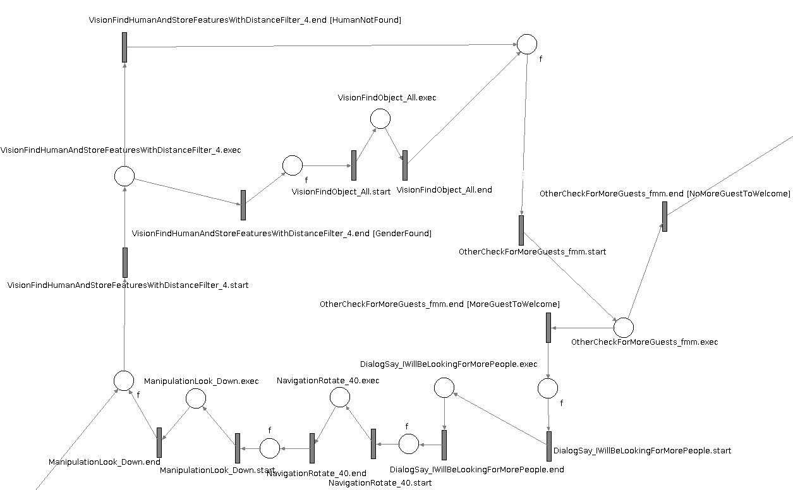

# Manager

The manager is the core module of our architecture. It is regarded as a decision maker to decide which actions to perform and trigger the related components for achieving a desired goal. For instance, the actions taken by the manager could be navigating to a specified location, communicating with humans, detecting and manipulating objects in the surrounding environment. The manager is implemented using a Petri Net solution. It is a directed graph of places and transitions that allows parallel processing and versatile finite-state machines.

Unlike other process models, each Petri net had an exact mathematical definition of its execution semantics. 
Petri Nets are composed of markers that triggered a transition to move from place to place. Multiple markers could be requested for a transition acting like a semaphore. The possibility of having multiple markers in the graph makes it non-deterministic meaning it is suitable for concurrent processing.
For each task, a plan was defined to describe the different steps of actions that could be encountered as well as sub-plans that would be triggered upon certain conditions. Having sub-plans allows us to have a readable and modular approach. Besides, it allows the reuse of existing actions and sub-plans in the context of different tasks. 

To execute our Petri Net with ROS, we use a package named Petri Net Plans, which allow to link a set of places and transitions to the reference of C++ functions. Each function could then act as an independent process firing one or multiple ROS nodes and returning a state to the Petri net to change state. Having a returning state is primordial to adapt the next action and the rest of the task depending on its result. Moreover, the manager is capable of re-planning its behaviour in the situation of failure of certain actions or in blocking situations where the robot could not proceed further. 
One issue we encountered with using different processes was managing shared data between ROS nodes. To resolve this issue, we use SQLite, an embedded persistent storage solution that does not require any server to run.
