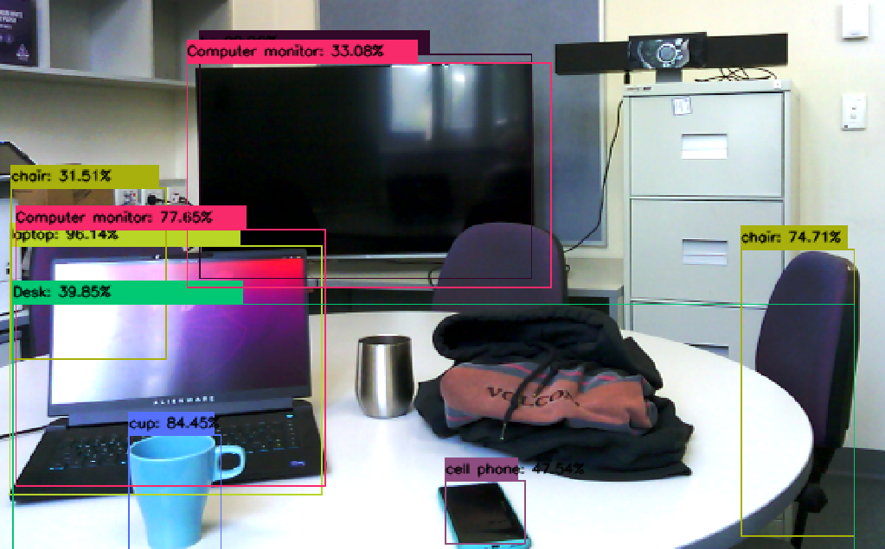
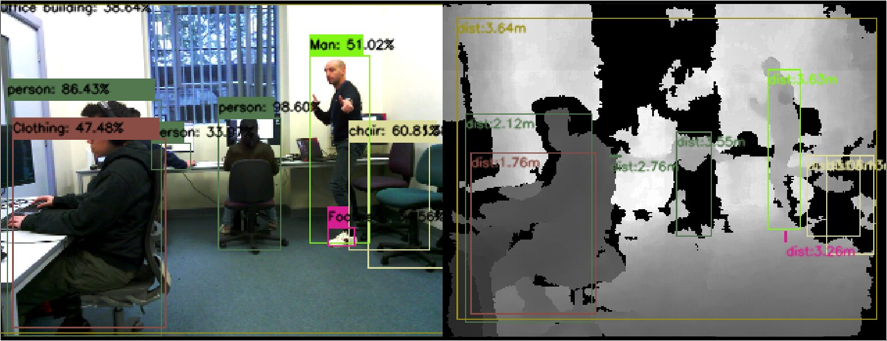
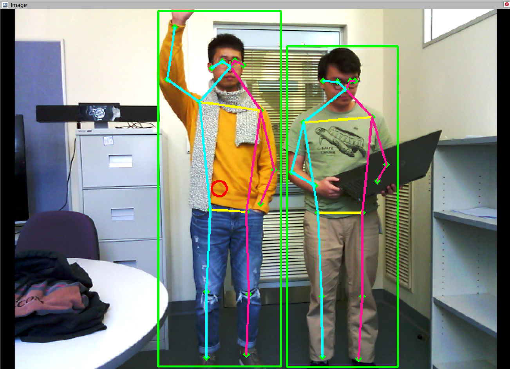

# Perception

- [Perception](#perception)
  - [Object detection](#object-detection)
  - [Color Estimation](#color-estimation)
  - [Person detection](#person-detection)
  - [Age estimation](#age-estimation)
  - [Pose detection](#pose-detection)
  - [RViz Visualization](#RViz-Visualization)

## Object detection
This module provides a set of ROS services with parameters, including a distance filter to prevent detecting objects outside of the arena.
All objects are detected by default. A home-made combination of pre-trained
Single Shot Detector (SSD) with InceptionV3 (600 classes) and MobileNet (80 classes from COCO) are used.

Based on such detection, specific post-processing are made. For instance, to tackle the task ''stickler for the rules'', a shoe on/off and drink on hand service is made as \texttt{/shoes\_and\_drink\_detection}. To detect the presence of drinks, we interpolate the 3D pose of detected objects with the 3D pose of wrist body joints detected by the pose estimation detector.
We are also able to detect chairs and provide information regarding whether a specific seat is available or taken associated with the surrounding complex situations, 

## Color Estimation
Based on detected objects and persons using the RGB camera, color estimation is computed.
A K-means clustering algorithm is applied to extract some dominant colors from a detected image. RGB pixel values are separated into five clusters for each bounding box of a detected object. Then, the raw pixel values are replaced by the RGB values of their corresponding cluster centroids. Finally, the closest X11 color is used to deliver a common color name.

## Person detection
A tailored home-made combination of SSD with Inception, SSD with MobileNet and [MoveNet Mulitpose](/https://www.tensorflow.org/hub/tutorials/movenet) is used to detect persons. 
SSD with MobileNet is used to get genders of persons.
Depending on the distance to a target, Movenet is used for short range detection and SSD for long range detection.

## Age estimation

Human faces images are cropped using SSD MobileNet detector. Then age estimation is computed based on the cropped image.
Convolutional neural network model (CNN) based caffemodel \cite{LH:CVPRw15:age} and [TensorFlow Lite model](https://github.com/radualexandrub/Age-Gender-Classification-on-RaspberryPi4-with-TFLite-PyQt5) (initially for Raspberry Pi) are used for estimating human age.

## Pose detection

A CNN-based model (MoveNet Multipose) predicts human joint locations of multiple persons from an RGB image . The model is able to detect 17  body joints of up to 20 persons in the same frame. It is the best trade-off between speed and accuracy for edge devices (originally designed to run on smartphones).
Similarly, a service applies the pose detector to detect a hand waving information from a customer in the restaurant task.

## RViz Visualization
Based on the pose infomation collected, each object detected (inclusing persons) will be represented as a marker in RViz.
All person detected will be represented as a red cylinder, while the non-human objects are represented as a green shpere. All the markers are drawn in their true vertical and horizontal dimension.

s.

